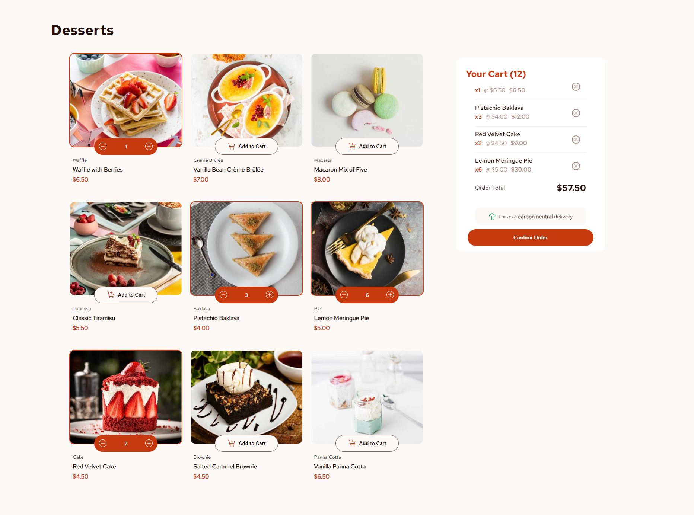

# Frontend Mentor - Product list with cart solution

This is a solution to the [Product list with cart challenge on Frontend Mentor](https://www.frontendmentor.io/challenges/product-list-with-cart-5MmqLVAp_d). Frontend Mentor challenges help you improve your coding skills by building realistic projects.

## Table of contents

- [Overview](#overview)
  - [The challenge](#the-challenge)
  - [Screenshot](#screenshot)
  - [Links](#links)
- [My process](#my-process)
  - [Built with](#built-with)
  - [Continued development](#continued-development)
  - [Useful resources](#useful-resources)
- [Author](#author)

## Overview

### The challenge

Users should be able to:

- Add items to the cart and remove them
- Increase/decrease the number of items in the cart
- See an order confirmation modal when they click "Confirm Order"
- Reset their selections when they click "Start New Order"
- View the optimal layout for the interface depending on their device's screen size
- See hover and focus states for all interactive elements on the page

### Screenshot

### Links

- Solution URL: [Add solution URL here](https://your-solution-url.com)

## My process

### Built with

- CSS Flexbox
- [React](https://reactjs.org/) - JS library
- [ReactMotion](https://motion.dev) - React animation library

### Continued development

In the future I want to focus on creating more reusable components, managing state the correct way as well as paying attention to the performance of the application.

### Useful resources

- [React Motion Tutorial](https://www.youtube.com/watch?v=31y7-k3ZG0g&t=475s) this helped me when I was implementing the animations
- [React Motion Docs](https://motion.dev/docs/react-quick-start) - offical react motion documentation also helped me with the animations
- [The Ultimate React Course_2024: React, Next.js, Redux & More](https://www.udemy.com/course/the-ultimate-react-course/?couponCode=KEEPLEARNING) this is a course I'm currently enrolled at. It has greatly helped me understand the proper use of state, how to share state between components, derived state as well as key react development concepts and templates.

## Author

- Frontend Mentor - [@TaseZmaj](https://www.frontendmentor.io/profile/TaseZmaj)
